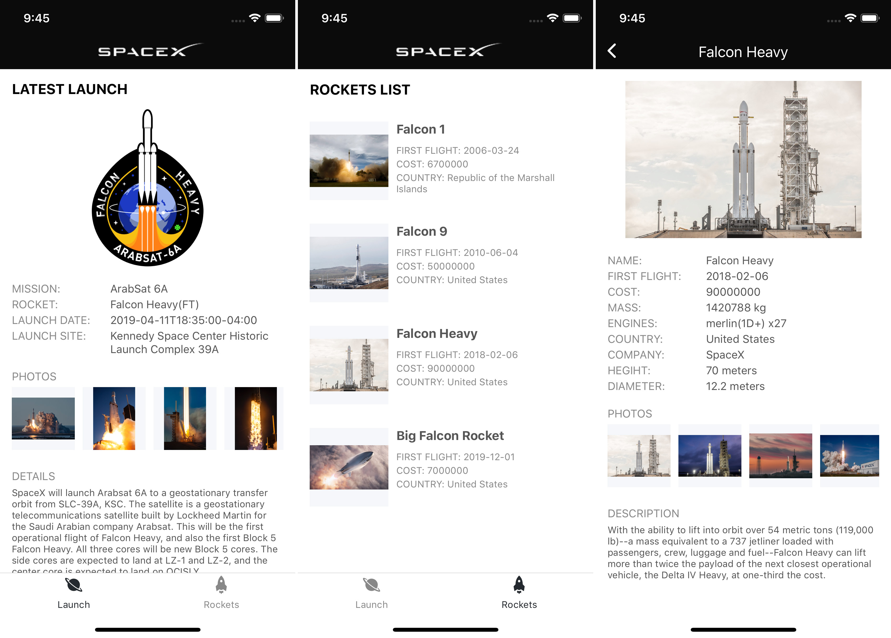

# 在Hello World之后（React Native项目搭建）


很多小伙伴对React Native（以下简称RN）的了解估计都只停留在 react-native init sampleApp 步骤，环境搭好了，却不知道怎么开始下一步。笔者这篇文章就是告诉大家Hello World之后的故事。

> 注意，笔者示例使用的RN版本为最新（0.59.4）

如图，我们目标是一个使用spaceX的API开发的只有三个页面的App样例。


## 目录结构

Hello World 之后，我首先创建如下目录

```
  src
    component  //组件
    dao        //数据处理
    router     //路由
    view       //视图
      home
      detail
      list
```

如图我们创建目录之后，我们创建home、list、detail三个页面。

比如说，我们用home来显示最近一次火箭的发射情况，list显示现有的火箭列表，detail为火箭详情页。

我们可以先让每个页面返回一个简单的`Text`组成的`Component`，例如home

```js
import React, { Component } from 'react';
import { View, Text } from 'react-native';

export default class Home extends Component {
    constructor(props) {
        super(props);
    }
    render() {
        return <Text> Home </Text>
    }
}
```


## 导航路由

接下来我们配置路由，目前来说`react-navigation`是RN官方推荐也是比较流行的一个方案。

> 注意，笔者目前使用的是3.x的版本，与2.x有一些差别，需要另外安装`react-native-gesture-handler` 并link其原生依赖。具体可以看[文档](https://reactnavigation.org/docs/zh-Hans/getting-started.html#%E5%AE%89%E8%A3%85)

安装之后，我们在router文件夹下新建index.js作为的我们的路由文件

```ts
import React from 'react'
import {Image,Text,View} from 'react-native'
import {createAppContainer,createBottomTabNavigator,createStackNavigator,KeyBoardHiddenTabBar,SafeAreaView} from 'react-navigation'
import Ionicons from 'react-native-vector-icons/Ionicons';
//引入各个页面
import Home from '../view/home'
import List from '../view/list'
import Detail from '../view/detail'

//创建一个Tab导航
const TabNavigator = createBottomTabNavigator(
//第一个参数为导航路由的映射RouteConfigs
{
    Home: {
        //screen为Component或者Navigator
        screen: Home,
        //导航选项
        navigationOptions: {
            tabBarLabel: 'Launch',
        },
    },
    List: {
        screen: List,
        navigationOptions: {
            tabBarLabel: 'Rockets',
        },
    }
}, 
//第二个参数为导航的一些基本配置对象StackNavigatorConfig
{
    defaultNavigationOptions: ({ navigation }) => ({
        //自定义tabBar的icon
        tabBarIcon: ({ focused, horizontal, tintColor }) => {
            const { routeName } = navigation.state;
            let iconName;
            if (routeName === 'Home') {
                iconName = 'md-planet';
            } else if (routeName === 'List') {
                iconName = `md-rocket`;
            }
            return <Ionicons name={iconName} size={25} color={tintColor} />
        },
    }),
    animationEnabled: false,
    swipeEnabled: false,
    //tabBar的options样式
    tabBarOptions: {
        activeTintColor: '#24292e',
        inactiveTintColor: '#888',
        labelStyle: {
            fontSize: 12,
        },
        style: {
            backgroundColor: 'white'
        },
        allowFontScaling: false
    },
    //默认初始路由
    initialRouteName: 'Home'
})
//公共头部样式提出
const headerStyles = {
    headerStyle: {
        backgroundColor: '#0b0b0b',
        height: 44,                                      
        elevation: 0, 
        shadowOpacity: 0, 
        borderBottomWidth: 0
    },
    headerTitleStyle: {
        fontWeight: 'normal',
        color: '#fff',
        fontSize: 19,
        alignSelf: 'center',
        textAlign: 'center',
        flexGrow: 1
    }
}

//自定义一个酷炫的页头给Tab用
const tabHeader = ()=>{
    return <SafeAreaView style={{backgroundColor:'#0b0b0b'}}>
        <View style={{alignItems: 'center',height:44}}>
        <Image style={{width:135,height:18,marginLeft:10,marginTop:10}} resizeMode={'contain'} source={require('../res/img/spacex_logo_white.png')} />
        </View>
    </SafeAreaView>
}

//创建一个Stack导航，其中Tab路由的screen即是Tab导航
const AppNavigator = createStackNavigator({
    Tab:{
        screen:TabNavigator,
        //导航选项
        navigationOptions: {
            header:tabHeader
        }
    },
    Detail:{
        screen: Detail,
        //导航选项
        navigationOptions: ({navigation}) => {
            return {
                headerLeft: <Ionicons onPress={()=> navigation.goBack()} style={{marginLeft:15}} name='ios-arrow-back' color="#fff" size={28} />,
                ...headerStyles
            }
        }
    }
},{
    initialRouteName: 'Tab'
})
//使用createAppContainer返回Component给入口App.js使用
export default createAppContainer(AppNavigator);

```

> 上面文件使用了react-native-vector-icons字体图标库组件，该组件在安装后除了link大法之后还需要其他操作，比如ios需要拖动库中的Fonts文件夹到Xcode目录中并修改Info.plist文件。具体出门右转[文档](https://github.com/oblador/react-native-vector-icons#installation)


然后修改入口App.js

```js
import React, {Component} from 'react';
import {StatusBar} from 'react-native';
import AppContainer from './src/router'

export default class App extends Component{
    constructor(){
        super()
        //因为页头设置是深色，所以设置了StatusBar为白色字体
        StatusBar.setBarStyle('light-content');
    }
    render() {
        return <AppContainer />
    }
}
```
这样以来我们就做好了一个简单的路由系统。路由中的页面的`props`会有`navigation`对象，我们可以通过它进行页面跳转，参数传递等等。

例如，在view中list页面，给`Text`添加`onPress`属性。

```js
    <Text onPress={()=>this.props.navigation.navigate('Detail')}> Go To Detail </Text>
```

Reload一下，你就能看到一个简单的架子了，点击Tab的图标进行Tab跳转，点击List页面中 Go To Detail 可以跳转到Detail页面。


## 接口数据层处理

目录中，dao目录主要是用于存放我们数据处理文件。

我们可以在dao中封装一层叫做BaseDao的父类，方便我们对请求的参数、url、headers、错误处理、超时处理等做一些统一的处理。

```ts
//BaseDao.js
import {Alert} from 'react-native'
import RNFetchBlob from 'rn-fetch-blob'
const qs = require('qs');

const APIVersion = 'v3'
export default class BaseDao {
    constructor() {
        this.baseURL = 'https://api.spacexdata.com/';
    }
    request(requestArgs) {
        return new Promise(async (resolve, reject) => {
            let { url, method, headers, params, data, enctype } = requestArgs;
            //url
            url = this.baseURL + APIVersion + url;
            if (params) {
                //序列化query参数
                url = url + '?' + qs.stringify(params, { arrayFormat: 'repeat' });
            }
            try {
                let task = RNFetchBlob.fetch(method, url, {
                    //headers 处理
                    ...headers,
                    'Content-Type': method === 'POST' ? (enctype ? enctype : 'multipart/form-data') :'application/json'
                },data);
                //超时统一处理
                let timer = setTimeout(() => {
                    Alert('Request Over Time')
                }, 60000);
                task.then(res => {
                    timer && clearTimeout(timer);
                    let json = res.json();
                    if(json && json.error){
                        reject(json.error);
                    }else{
                        resolve(json)
                    }
                }).catch(err => {
                    reject(err);
                });
            } catch(err) {
                reject(err);
            }
        });
    }
}
```

> 上述代码我用到了`rn-fetch-blob`这个库，它不仅可以处理一些接口请求，还有文件系统，可以处理文件上传，文件的本地存储等等。

例如，针对home页面，我们可以新建HomeDao继承自BaseDao。假定，我们需要在home获取最近一次的火箭发射情况。

```ts
//HomeDao.js
import BaseDao from './BaseDao';

class Home extends BaseDao{
    constructor(){
        super()
    }
    getLatestLaunch(){
        return this.request({
            url:'/launches/latest',
            method:'GET',
        })
    }
}

export default new Home()
```

接下来我们就可以在home的页面中调用`getLatestLaunch`来获取数据了,例如

```js
//home/index.js 片段
componentDidMount(){
    HomeDao.getLatestLaunch().then(data => {
        this.setState({
            loading: false,
            data
        })
    })
}

```

## 渲染页面

取到数据后，我们就可以用在`render`中自由翱翔，渲染页面了。

```js
//home/index.js 片段
render() {
    let {loading,data} = this.state;
    let {mission_name,links,details,launch_date_local,launch_site,rocket} = data;
    return (
        <View style={styles.wrap}>
            {loading ? 
            <View style={styles.loadingWrap}>
                <ActivityIndicator />
            </View>
            :
            <ScrollView>
                <View style={styles.mission_wrap}>
                    <Text style={styles.title}>LATEST LAUNCH</Text>
                    <View style={styles.image_wrap}>
                        <Image resizeMode={'contain'} style={styles.mission_patch} source={{uri:links.mission_patch}} />
                    </View>
                    <View style={styles.item_wrap}>
                        <View style={styles.item}>
                            <Text style={styles.label}>MISSION:</Text>
                            <Text style={styles.text}>{mission_name}</Text>
                        </View>
                    </View>
                    <Text style={styles.detail_title}>PHOTOS</Text>
                    <ScrollView style={styles.flickr_wrap} horizontal={true} >
                        {links.flickr_images.map((item,i)=>{
                            return <Image resizeMode={'contain'} key={i+''} style={styles.flickr_img} source={{uri:item}} />
                        })}
                    </ScrollView>
                    <Text style={styles.detail_title}>DETAILS</Text>
                    <Text style={styles.details}>{details}</Text>
                </View>
            </ScrollView>
        }
        </View>
    );
}

```

同理我们，可以新建ListDao用来存放list页面中数据请求，然后在list页面中渲染数据

```js
//home/list.js 片段
_renderItem({item,index}){
    const hasImg = item.flickr_images && item.flickr_images.length > 0
    return <TouchableHighlight activeOpacity={1} underlayColor='#dae0e5' onPress={()=> this.props.navigation.navigate('Detail',{id:item.rocket_id,name:item.rocket_name})} style={styles.rocket_item}>
        <Fragment>
            {hasImg && <Image style={styles.item_img} source={{uri:item.flickr_images[0]}} resizeMode={'contain'} />}
            <View style={styles.item_info}>
                <Text style={styles.item_name}>{item.rocket_name}</Text>
            </View>
        </Fragment>
    </TouchableHighlight>
}

render() {
    let {loading,list} = this.state;
    return (
        <View style={styles.wrap}>
            {loading ? <View style={styles.loadingWrap}>
                <ActivityIndicator />
            </View>:
            <Fragment>
                <Text style={styles.title}>ROCKETS LIST</Text>
                <FlatList 
                    data={list}
                    renderItem={this._renderItem}
                    keyExtractor={item=> item.rocket_id}
                />
            </Fragment>
        }
        </View>
    );
}

```
上述列表使用了RN中最常见的列表组件`FlatList`，关于`FlatList`，可讲的还有很多，小到下拉刷新、上拉加载，大到长列表内存回收等性能问题，本文暂不深入探讨。

[其他源码](https://github.com/fancyqin/sampleApp)

## 集成Redux


## 第三方组件

经常逛Github的同学应该知道，几乎任何流行的框架都有一个叫做awesome-xxx的仓库，react-native亦然，你可以在awesome-react-native这个仓库中找到许多第三方组件库。下面列举一些我常用的组件库

#### 基础类
- `react-navigation` 路由导航
- `react-native-splash-screen` App启动图设置
- `react-native-storage` 本地持久化
- `react-native-linear-gradient` 渐变色组件
- `lottie-react-native bodymovin` 导入的动画解决方案
- `react-native-pdf` PDF文件预览
- `react-native-share` 分享组件
- `react-native-device-info` 设备信息获取
- `rn-fetch-blob` 请求处理
- `react-native-vector-icons` 字体图标

#### 图片处理类
- `react-native-swiper` 轮播组件
- `react-native-image-cache-hoc` 图片缓存
- `react-native-image-gallery` 放大图
- `react-native-image-picker` 选择相册、图片上传

#### 修复类
- `react-native-keyboard-aware-scroll-view` 含scroll等组件键盘弹出时候遮挡输入框问题修复
    

> 注意，有一些需要原生代码支持的第三方组件，需要link命令，但是Android在link命令时候，往往会出错，这就需要我们手动修改


> 另外注意，一些第三方组件使用的android sdk版本各不相同，这可能是你苦苦找寻的Android启动不了的环境问题之一。


## OVER

以上是比较浅显的讲述了在RN hello world之后的一些文件布局、全局路由搭建等操作。希望能给刚刚接触RN的你一点参考。

